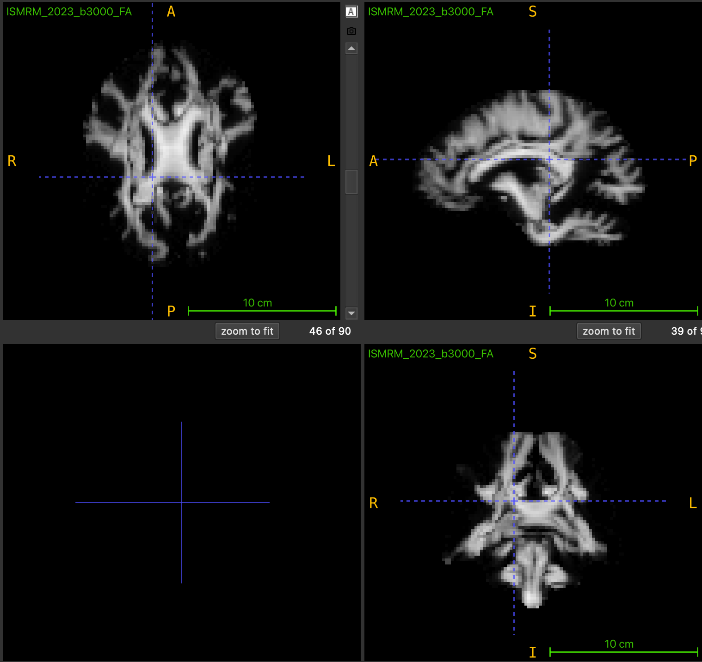
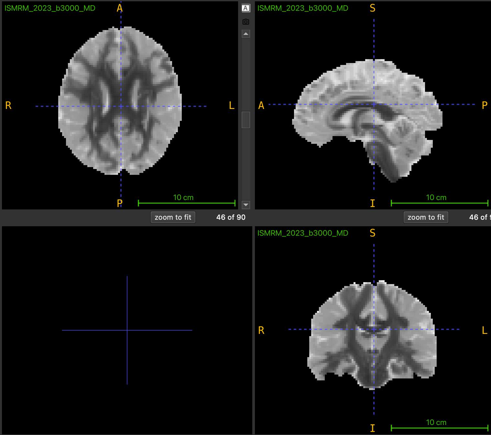
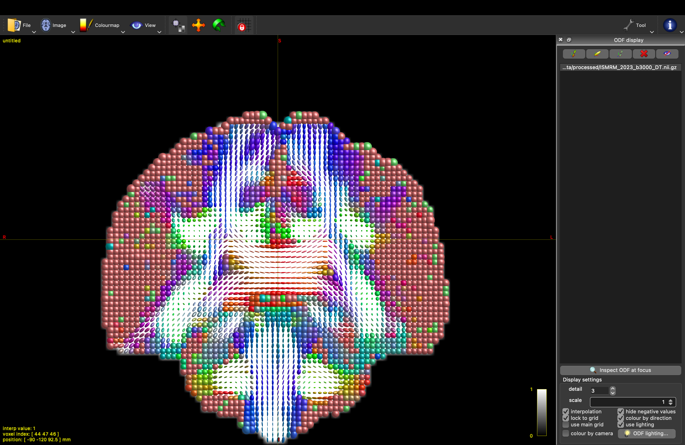

# Diffusion Tensor Imaging (DTI)

Implementación desde cero del modelo de Tensor de Difusión (DTI) para imágenes de resonancia magnética ponderadas por difusión (DW-MRI).

## Características

- Estimación del tensor de difusión mediante Mínimos Cuadrados Ordinarios (OLS).
- Construcción explícita de la matriz de diseño.
- Implementación modular del pipeline DTI.
- Reconstrucción voxel a voxel del tensor de difusión.
- Cálculo de métricas derivadas:
  - Mean Diffusivity (MD)
  - Fractional Anisotropy (FA)
  - Principal Diffusion Direction (PDD)
- Exportación de resultados en formato NIfTI.
- Suite de pruebas automatizadas con pytest.

# Fundamento teórico

La señal de difusión está modelada por:

```math
S_i=S_0 e^{-b_i g_i^T D g_i}
```

donde:

* $S_0$: Señal sin ponderación de difusión ($b = 0$).
* $S_i$: Señal medida para la dirección $i$.
* $b_i$: Factor de ponderación de difusión ($b\text{-value}$).
* $\mathbf{g}_i$: Vector de dirección del gradiente.
* $D$: Tensor de difusión.

Aplicando logaritmo natural:

```math
-\frac{\ln(S_i/S_0)}{b_i}
=
g_i^T D g_i
```

lo que permite construir un sistema lineal de la forma:

```math
B=A\hat d
```

donde:

* ($B$) contiene las observaciones experimentales.
* ($A$) es la matriz de diseño construida a partir de los gradientes.
* ($\hat d$) contiene los seis parámetros independientes del tensor.

La estimación se realiza mediante mínimos cuadrados:

```math
\hat d=(A^TA)^{-1}A^TB
```
---
## Derivación matemática completa

La derivación detallada del modelo, incluyendo:

- Linealización de la ecuación de Stejskal-Tanner.
- Construcción de la matriz de diseño $(A)$.
- Definición del vector de observaciones $(B)$.
- Formulación del problema de mínimos cuadrados.
- Obtención de la solución

```math
\hat d = (A^T A)^{-1}A^T B
```

puede consultarse en:

```text
docs/dti_theory.pdf
```
---

# Relación entre teoría e implementación

| Teoría                              | Archivo            |
| ----------------------------------- | ------------------ |
| Construcción de $(A)$                 | `design_matrix.py` |
| Construcción de $(B)$                 | `tensor.py`        |
| Resolución $(\hat d=(A^TA)^{-1}A^TB)$ | `least_squares.py` |
| Ajuste vóxel a vóxel                | `estimation.py`    |
| Reconstrucción del tensor           | `estimation.py`    |
| Cálculo de autovalores              | `metrics.py`       |
| Cálculo de MD                       | `metrics.py`       |
| Cálculo de FA                       | `metrics.py`       |
| Extracción del PDD | `metrics.py` |
| Lectura de datos                    | `load_data.py`     |
| Escritura de resultados             | `save_data.py`     |

---

# Estructura del proyecto

La implementación completa del proyecto incluye módulos de tractografía,
pero este documento se enfoca únicamente en el pipeline DTI.

```text
.
├── data
|   ├── raw
│   |   ├── ISMRM_2023_b3000.nii.gz
│   |   ├── ISMRM_2023_b3000.bval
│   |   ├── ISMRM_2023_b3000.bvec
│   |   └── ISMRM_2023_b3000_mask.nii
│   |
|   └── processed
│
├── docs
│   └── images
│
├── scripts
│   └── run_fit.py
│
src/
├── dti/
│   ├── design_matrix.py
│   ├── tensor.py
│   ├── least_squares.py
│   ├── estimation.py
│   └── metrics.py
│
├── io/
│   ├── load_data.py
│   └── save_data.py
│
└── tractography/
|   └── ...
│
├── tests
│
├── requirements.txt
└── README.md
```

---

# Dependencias principales

- numpy
- nibabel
- dipy
- pytest

Las versiones exactas se encuentran especificadas en:

```text
requirements.txt
```
---

# Instalación

Crear un entorno virtual:

```bash
python -m venv .venv
```

Activar el entorno:

### Linux / macOS

```bash
source .venv/bin/activate
```

### Windows

```bash
.venv\Scripts\activate
```

Instalar dependencias:

```bash
pip install -r requirements.txt
```

---

# Dataset

Los experimentos fueron realizados utilizando el dataset:

ISMRM 2023 Tractography Challenge Dataset

Archivos utilizados:

- ISMRM_2023_b3000.nii.gz
- ISMRM_2023_b3000.bval
- ISMRM_2023_b3000.bvec
- ISMRM_2023_b3000_mask.nii

# Datos de entrada

Los archivos de entrada deben colocarse en:

```text
data/raw/
├── ISMRM_2023_b3000.nii.gz
├── ISMRM_2023_b3000.bval
├── ISMRM_2023_b3000.bvec
└── ISMRM_2023_b3000_mask.nii
```

---

# Ejecución

Ejecutar:

```bash
python -m scripts.run_fit
```

---

# Salidas

La ejecucuón genera los siguientes voulúmenes:

```text
data/processed/tensors/
└── ISMRM_2023_b3000_DT.nii.gz
```

Los seis componentes se almacenan en el orden:

```text
[Dxx, Dyy, Dzz, Dxy, Dxz, Dyz]
```

Posteriormente pueden generarse mapas escalares como:

````text
data/processed/metrics/
├── ISMRM_2023_b3000_FA.nii.gz
├── ISMRM_2023_b3000_MD.nii.gz
└── ISMRM_2023_b3000_PDD.nii.gz
````
donde:
* FA: mapa de anisotropía fraccional.
* MD: mapa de difusividad media.
* PDD: dirección principal de difusión.
---

# Resultados y Mapas Microestructurales

A partir del tensor de difusión estimado voxel a voxel, se generaron los volúmenes paramétricos y las reconstrucciones de orientación espacial correspondientes. El pipeline discrimina con éxito las zonas de alta direccionalidad (materia blanca) de las zonas isotrópicas (líquido cefalorraquídeo).

### Mapas Escalares de Difusión

| Anisotropía Fraccional (FA) | Difusividad Media (MD) |
| :---: | :---: |
|  |  |
| *Valores cercanos a 1.0 (brillante) indican difusión altamente restringida en tractos axonales.* | *Valores altos (brillante) corresponden a difusión libre en los ventrículos laterales.* |

### Reconstrucción Geométrica del Tensor (Glifos)

La imagen inferior muestra la orientación tridimensional del tensor ($D$) estimada por nuestro módulo `estimation.py` y renderizada mediante los glifos elipsoidales de MRtrix. La orientación del mapa geométrico sigue el código de colores estandarizado: **Rojo** (Izquierda-Derecha), **Verde** (Anterior-Posterior), y **Azul** (Craneal-Caudal).

<p align="center">
  
  <br>
  <i>Vista de los elipsoides de difusión en el cuerpo calloso. La forma alargada (prolada) valida el correcto cálculo de los autovalores y autovectores primarios.</i>
</p>

# Métricas escalares

## Difusividad Media (MD)

$$MD = \frac{\lambda_1 + \lambda_2 + \lambda_3}{3}$$

donde $\lambda_1, \lambda_2, \lambda_3$ son los autovalores del tensor de difusión.

## Anisotropía Fraccional (FA)

```math
FA=
\sqrt{\frac{3}{2}}
\frac{
\sqrt{
(\lambda_1-MD)^2+
(\lambda_2-MD)^2+
(\lambda_3-MD)^2
}
}{
\sqrt{
\lambda_1^2+\lambda_2^2+\lambda_3^2
}
}
```

## Dirección Principal de Difusión (PDD)

La dirección principal de difusión se obtiene como el autovector asociado
al mayor autovalor del tensor:

```math
D\mathbf{v}_1=\lambda_1\mathbf{v}_1
```
donde:
* $\lambda_1$ es el mayor autovalor.
* $\mathbf{v}_1$ es el autovector principal.

Este vector representa la dirección dominante de difusión dentro del vóxel
y constituye la base para los algoritmos de tractografía determinística.
---

# Validación

La implementación fue validada mediante:

- pruebas unitarias de cada módulo,
- comparación de dimensiones esperadas,
- verificación de la reconstrucción del tensor.

---

# Pruebas

Ejecutar todos los tests:

```bash
pytest
```

o

```bash
pytest tests/
```

---

# Descripción de módulos

### `tensor.py`

Construye el vector:

```math
B_i=
-\frac{\ln(S_i/S_0)}{b_i}
```

a partir de las señales medidas.

### `design_matrix.py`

Construye la matriz de diseño:

```math
A=
\begin{pmatrix}
g_x^2 &
2g_xg_y &
2g_xg_z &
g_y^2 &
2g_yg_z &
g_z^2
\end{pmatrix}
```

para cada dirección de gradiente.

### `least_squares.py`

Calcula la pseudoinversa y resuelve:

```math
\hat d=(A^TA)^{-1}A^TB
```

### `estimation.py`

Aplica el ajuste de mínimos cuadrados a cada vóxel de la imagen.

### `metrics.py`

Reconstruye el tensor:

```math
D=
\begin{pmatrix}
D_{xx} & D_{xy} & D_{xz}\\
D_{xy} & D_{yy} & D_{yz}\\
D_{xz} & D_{yz} & D_{zz}
\end{pmatrix}
```

obtiene los autovalores y autovectores del tensor,
calcula FA y MD, y extrae la Dirección Principal
de Difusión (PDD).

---

# Referencias

* Basser, P. J., Mattiello, J., & LeBihan, D. (1994). MR diffusion tensor spectroscopy and imaging.
* Stejskal, E. O., & Tanner, J. E. (1965). Spin diffusion measurements: spin echoes in the presence of a time-dependent field gradient.
* Descoteaux, M. (2023). Diffusion MRI: Theory, Methods and Applications.
