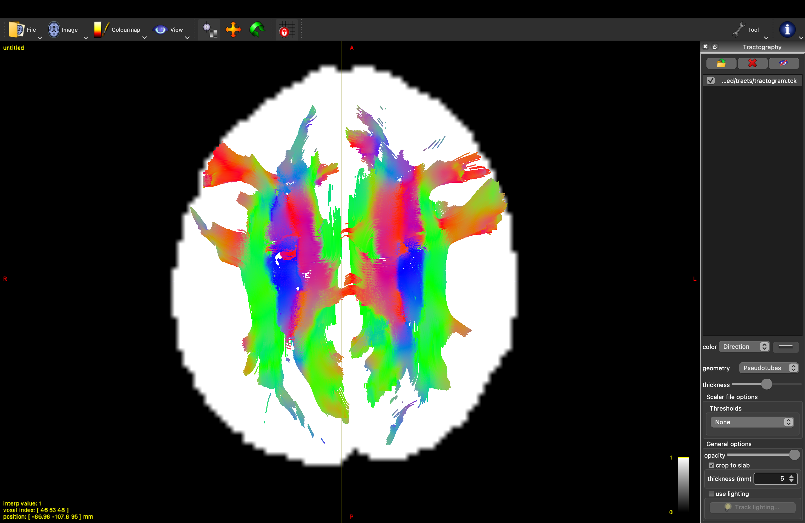

# Tractografía Determinística

Implementación desde cero de un algoritmo de tractografía determinística basado en la Dirección Principal de Difusión (PDD) obtenida a partir del modelo de Tensor de Difusión (DTI).

---

# Características

* Generación automática de semillas en materia blanca.
* Soporte para siembra regular (grid) y aleatoria (random).
* Interpolación trilineal de la Dirección Principal de Difusión (PDD).
* Corrección del problema del signo antipodal.
* Propagación mediante integración de Euler.
* Seguimiento bidireccional (forward y backward).
* Criterios anatómicos de parada:

  * Salida de la máscara cerebral.
  * Umbral mínimo de FA.
  * Curvatura máxima permitida.
  * Longitud máxima de propagación.
* Exportación del tractograma en formato `.tck`.

---

# Fundamento teórico

Una vez estimado el tensor de difusión

```math
D
```

se calculan sus autovalores y autovectores resolviendo:

```math
D\mathbf{v}_i=\lambda_i\mathbf{v}_i
```

donde:

* $\lambda_i$ son los autovalores.
* $\mathbf{v}_i$ son los autovectores.

La dirección principal de difusión corresponde al autovector asociado al mayor autovalor:

```math
\mathbf{PDD}=\mathbf{v}_1
```

Esta dirección aproxima localmente la orientación predominante de los haces axonales dentro de cada vóxel.

---

# Interpolación espacial

Las semillas y las trayectorias se encuentran en posiciones continuas del espacio, por lo que la dirección de difusión debe interpolarse entre vóxeles vecinos.

La implementación utiliza interpolación trilineal sobre los ocho vóxeles que rodean la posición actual:

```math
\mathbf{v}(x,y,z)
=
\sum_{i=1}^{8}
w_i \mathbf{v}_i
```

donde:

* $\mathbf{v}_i$ son los vectores vecinos.
* $w_i$ son los pesos de interpolación.

Después de interpolar, el vector resultante se normaliza para conservar longitud unitaria.

---

# Problema del signo antipodal

Los autovectores poseen una ambigüedad intrínseca de signo:

```math
\mathbf{v}
\equiv
-\mathbf{v}
```

Por esta razón, vóxeles vecinos pueden contener direcciones equivalentes pero orientadas en sentidos opuestos.

Antes de realizar la interpolación, todos los vectores vecinos son alineados con respecto a una dirección de referencia utilizando:

\mathbf{v}_i \leftarrow \text{sign}(\mathbf{v}_i \cdot \mathbf{v}_{ref})\mathbf{v}_i

Esto evita cancelaciones artificiales durante la interpolación.

---

# Propagación de Streamlines

La propagación utiliza integración explícita de Euler.

Sea

```math
\mathbf{x}_k
```

la posición actual y

```math
\mathbf{v}_k
```

la dirección interpolada.

La siguiente posición se calcula como:

```math
\mathbf{x}_{k+1}
=
\mathbf{x}_k
+
h\mathbf{v}_k
```

donde:

* $h$ es el tamaño de paso (`step_size`).

La integración se realiza tanto en dirección positiva como negativa:

```math
+\mathbf{v}_k
```

y

```math
-\mathbf{v}_k
```

para obtener una streamline completa.

---

# Criterios de parada

La propagación se detiene cuando ocurre alguna de las siguientes condiciones:

## Salida del cerebro

La posición actual abandona la máscara cerebral.

## Baja anisotropía

```math
FA < FA_{min}
```

Valores bajos de FA suelen corresponder a materia gris o líquido cefalorraquídeo.

## Curvatura excesiva

Si el ángulo entre dos pasos consecutivos supera:

```math
\theta_{max}
```

la streamline se detiene.

El ángulo se calcula mediante:

```math
\theta
=
\arccos
\left(
\frac{
\mathbf{v}_{k}
\cdot
\mathbf{v}_{k-1}
}{
\|\mathbf{v}_{k}\|
\|\mathbf{v}_{k-1}\|
}
\right)
```

## Longitud máxima

Se alcanza el número máximo de iteraciones permitido.

---

# Generación de Semillas

Las semillas se generan únicamente en regiones de materia blanca:

```math
FA \ge FA_{seed}
```

y

```math
Mask > 0
```

Se soportan dos estrategias:

## Grid

Genera una subrejilla uniforme dentro de cada vóxel.

Ejemplo:

```text
density = 2
```

produce:

```text
2 × 2 × 2 = 8 semillas por vóxel
```

## Random

Genera posiciones aleatorias uniformemente distribuidas dentro de los vóxeles válidos.

---

# Relación entre teoría e implementación

| Concepto                    | Archivo            |
| --------------------------- | ------------------ |
| Generación de semillas      | `seeds.py`         |
| Interpolación trilineal     | `interpolation.py` |
| Integración de Euler        | `propagation.py`   |
| Seguimiento bidireccional   | `propagation.py`   |
| Tracking multi-semilla      | `tracking.py`      |
| Exportación de tractogramas | `save_data.py`     |

---

# Estructura de módulos

```text
src/
└── tractography/
    ├── seeds.py
    ├── interpolation.py
    ├── propagation.py
    └── tracking.py
```

---

# Pipeline

## 1. Generación de semillas

```bash
python -m scripts.run_seeding
```

Salida:

```text
data/processed/seeds/seeds.npy
```

---

## 2. Tractografía

```bash
python -m scripts.run_tracking
```

Salida:

```text
data/processed/tracts/tractogram.tck
```

---

# Archivos de entrada

La tractografía requiere:

```text
data/processed/metrics/
├── ISMRM_2023_b3000_FA.nii.gz
├── ISMRM_2023_b3000_PDD.nii.gz

data/raw/
└── ISMRM_2023_b3000_mask.nii

data/processed/seeds/
└── seeds.npy
```

Estos archivos son generados previamente por el pipeline DTI.

---

# Resultados

La salida final es un tractograma en formato TrackVis:

```text
.tck
```

compatible con:

* MRtrix3

Las streamlines reconstruyen trayectorias aproximadas de los haces de materia blanca siguiendo la dirección principal de difusión estimada en cada vóxel.

## Tractografía determinística

La siguiente reconstrucción fue obtenida utilizando:

- Integración de Euler.
- Interpolación trilineal de la PDD.
- Umbral de FA.
- Restricción angular.
- Seguimiento bidireccional.

<p align="center">
  
  <br>
  <i>Reconstrucción de tractos de sustancia blanca obtenida mediante tractografía determinística.</i>
</p>
---

# Referencias

* Basser, P. J., Mattiello, J., & LeBihan, D. (1994). MR diffusion tensor spectroscopy and imaging.
* Mori, S., Crain, B. J., Chacko, V. P., & van Zijl, P. C. M. (1999). Three-dimensional tracking of axonal projections in the brain by magnetic resonance imaging.
* Descoteaux, M. (2023). Diffusion MRI: Theory, Methods and Applications.
